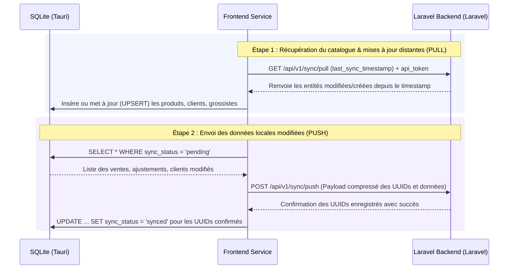

# PHARMAXY - Document de Conception & Mémoire d'Architecture
**Version :** 1.0 (V1)  
**Rôle :** Guide de Conception Logicielle & Mémoire Technique  
**Auteur :** Architecte Senior Tauri / Rust / TypeScript  
**Cible :** Système Hors-ligne en priorité (*Offline-First*) avec synchronisation distante Laravel  

---

## 1. Introduction & Choix Technologiques Clés

L'architecture de **Pharmaxy** repose sur des contraintes critiques liées au domaine officinal au Cameroun :
1. **Fiabilité Absolue (Offline-First) :** Les pharmacies ne peuvent pas se permettre une interruption de service à cause d'une coupure internet. La base locale SQLite (`tauri-plugin-sql`) est la source unique de vérité en cours de fonctionnement.
2. **Recherche Clinique et Commerciale Optimisée :** Recherche instantanée par **DCI (Dénomination Commune Internationale)** et par code CIP / code-barres.
3. **Traçabilité FEFO (First Expired, First Out) :** Priorisation systématique des lots de médicaments arrivant le plus tôt à péremption afin de minimiser le stock périmé.
4. **Spécificités Camerounaises :** 
   - Intégration du numéro d'agrément **MINSANTE** dans la table Pharmacie.
   - Utilisation de types **INTEGER** pour la monnaie (FCFA). En effet, le FCFA n'utilisant pas de centimes en pratique, l'utilisation d'entiers évite les approximations et les dérives de calculs de nombres à virgule flottante (`REAL`).

---

## 2. Structure Détaillée du Projet

Voici la cartographie du projet Tauri + React + TypeScript :

```text
pharmaxy/
├── src-tauri/                 # Backend natif Rust
│   ├── src/
│   │   ├── main.rs            # Point d'entrée de l'application
│   │   └── lib.rs             # Configuration de Tauri, enregistrement des plugins (tauri-plugin-sql)
│   ├── capabilities/
│   │   └── default.json       # Gestion fine des permissions (accès SQL autorisé)
│   ├── Cargo.toml             # Dépendances Rust (tauri, tauri-plugin-sql, etc.)
│   └── tauri.conf.json        # Configuration générale de l'application (fenêtres, bundle, identifiants)
│
├── src/                       # Frontend React / TypeScript
│   ├── assets/                # Images, logos, styles globaux
│   ├── db/                    # Couche d'accès aux données (DAL - Data Access Layer)
│   │   ├── database.ts        # Initialisation du singleton de connexion SQLite
│   │   ├── pharmacyQueries.ts # Requêtes SQL d'administration de l'officine
│   │   ├── productQueries.ts  # Requêtes SQL pour le catalogue produits / DCI
│   │   └── saleQueries.ts     # Requêtes SQL de vente et lignes de ticket (FEFO)
│   ├── App.tsx                # Composant racine React
│   ├── main.tsx               # Point d'entrée React / Vite
│   ├── App.css                # Styles globaux
│   └── vite-env.d.ts          # Typages environnement Vite
│
├── package.json               # Dépendances npm (React 19, Tauri v2 API, Tailwind v4)
├── tsconfig.json              # Configuration TypeScript globale
└── vite.config.ts             # Configuration du build Vite
```

---

## 3. Schéma SQL de la Base de Données Locale (SQLite)

Pour assurer une cohérence stricte et des performances maximales lors des recherches sur de gros catalogues de médicaments, voici le script de création des tables.

### 3.1. Script de Création des Tables (DDL)

```sql
-- Activation des contraintes de clés étrangères (à exécuter à chaque connexion)
PRAGMA foreign_keys = ON;

-- 1. Table : pharmacies
CREATE TABLE IF NOT EXISTS pharmacies (
    id INTEGER PRIMARY KEY AUTOINCREMENT,
    uuid TEXT UNIQUE NOT NULL,
    name TEXT NOT NULL,
    address TEXT,
    phone TEXT,
    owner_name TEXT,
    license_number TEXT, -- Agrément MINSANTE
    api_token TEXT,      -- Token d'authentification Laravel pour la synchro
    is_registered INTEGER DEFAULT 0, -- Booleen SQLite (0 = false, 1 = true)
    sync_status TEXT DEFAULT 'pending',
    created_at DATETIME DEFAULT CURRENT_TIMESTAMP,
    updated_at DATETIME DEFAULT CURRENT_TIMESTAMP
);

-- 2. Table : users (Les employés)
CREATE TABLE IF NOT EXISTS users (
    id INTEGER PRIMARY KEY AUTOINCREMENT,
    uuid TEXT UNIQUE NOT NULL,
    name TEXT NOT NULL,
    pin_code TEXT NOT NULL,          -- Code PIN à 4 chiffres (ex: '1234')
    role TEXT CHECK(role IN ('admin', 'cashier')) NOT NULL,
    sync_status TEXT DEFAULT 'pending',
    created_at DATETIME DEFAULT CURRENT_TIMESTAMP,
    updated_at DATETIME DEFAULT CURRENT_TIMESTAMP
);

-- 3. Table : products (Le Catalogue Médicaments)
CREATE TABLE IF NOT EXISTS products (
    id INTEGER PRIMARY KEY AUTOINCREMENT,
    uuid TEXT UNIQUE NOT NULL,
    name TEXT NOT NULL,
    dci TEXT,                        -- Dénomination Commune Internationale (ex: Amoxicilline)
    form TEXT,                       -- Forme (Comprimé, Sirop, Crème)
    dosage TEXT,                     -- Dosage (500mg)
    packaging TEXT,                  -- Conditionnement (Boîte de 30)
    barcode TEXT,                    -- Code CIP ou Code-barres
    selling_price INTEGER NOT NULL,  -- Prix de vente public en FCFA (sans centimes)
    min_stock_alert INTEGER DEFAULT 5,
    category TEXT,                   -- Catégorie simplifiée (Antibiotiques, Antalgiques)
    sync_status TEXT DEFAULT 'pending',
    created_at DATETIME DEFAULT CURRENT_TIMESTAMP,
    updated_at DATETIME DEFAULT CURRENT_TIMESTAMP
);

-- 4. Table : suppliers (Les Grossistes)
CREATE TABLE IF NOT EXISTS suppliers (
    id INTEGER PRIMARY KEY AUTOINCREMENT,
    uuid TEXT UNIQUE NOT NULL,
    name TEXT NOT NULL,
    phone TEXT,
    sync_status TEXT DEFAULT 'pending',
    created_at DATETIME DEFAULT CURRENT_TIMESTAMP,
    updated_at DATETIME DEFAULT CURRENT_TIMESTAMP
);

-- 5. Table : lots (Le cœur de la gestion des stocks et péremptions - FEFO)
CREATE TABLE IF NOT EXISTS lots (
    id INTEGER PRIMARY KEY AUTOINCREMENT,
    uuid TEXT UNIQUE NOT NULL,
    product_id INTEGER NOT NULL,
    lot_number TEXT NOT NULL,
    expiry_date TEXT NOT NULL,       -- Stocké en format ISO (YYYY-MM-DD) pour tris chronologiques
    purchase_price INTEGER NOT NULL, -- Prix d'achat en FCFA
    quantity_in_stock INTEGER NOT NULL CHECK(quantity_in_stock >= 0),
    supplier_id INTEGER,
    entry_date TEXT NOT NULL,        -- Format YYYY-MM-DD
    sync_status TEXT DEFAULT 'pending',
    created_at DATETIME DEFAULT CURRENT_TIMESTAMP,
    updated_at DATETIME DEFAULT CURRENT_TIMESTAMP,
    FOREIGN KEY(product_id) REFERENCES products(id) ON DELETE CASCADE,
    FOREIGN KEY(supplier_id) REFERENCES suppliers(id) ON DELETE SET NULL
);

-- 6. Table : clients (Gestion du Crédit / "Cahier Noir")
CREATE TABLE IF NOT EXISTS clients (
    id INTEGER PRIMARY KEY AUTOINCREMENT,
    uuid TEXT UNIQUE NOT NULL,
    name TEXT NOT NULL,
    phone TEXT,
    debt_balance INTEGER DEFAULT 0,  -- Solde débiteur en FCFA (dénormalisé pour accès rapide)
    sync_status TEXT DEFAULT 'pending',
    created_at DATETIME DEFAULT CURRENT_TIMESTAMP,
    updated_at DATETIME DEFAULT CURRENT_TIMESTAMP
);

-- 7. Table : sales (Les En-têtes de Vente)
CREATE TABLE IF NOT EXISTS sales (
    id INTEGER PRIMARY KEY AUTOINCREMENT,
    uuid TEXT UNIQUE NOT NULL,
    user_id INTEGER NOT NULL,
    client_id INTEGER,
    total_amount INTEGER NOT NULL,   -- Montant total payé en FCFA
    status TEXT CHECK(status IN ('completed', 'cancelled')) DEFAULT 'completed',
    sync_status TEXT DEFAULT 'pending',
    created_at DATETIME DEFAULT CURRENT_TIMESTAMP,
    updated_at DATETIME DEFAULT CURRENT_TIMESTAMP,
    FOREIGN KEY(user_id) REFERENCES users(id),
    FOREIGN KEY(client_id) REFERENCES clients(id)
);

-- 8. Table : sale_lines (Lignes de ticket avec lien vers les lots précis)
CREATE TABLE IF NOT EXISTS sale_lines (
    id INTEGER PRIMARY KEY AUTOINCREMENT,
    uuid TEXT UNIQUE NOT NULL,
    sale_id INTEGER NOT NULL,
    product_id INTEGER NOT NULL,
    lot_id INTEGER NOT NULL,         -- Traçabilité du lot pour calcul FEFO/Marge
    quantity INTEGER NOT NULL CHECK(quantity > 0),
    unit_price INTEGER NOT NULL,     -- Snapshot du prix de vente effectif
    sync_status TEXT DEFAULT 'pending',
    created_at DATETIME DEFAULT CURRENT_TIMESTAMP,
    updated_at DATETIME DEFAULT CURRENT_TIMESTAMP,
    FOREIGN KEY(sale_id) REFERENCES sales(id) ON DELETE CASCADE,
    FOREIGN KEY(product_id) REFERENCES products(id),
    FOREIGN KEY(lot_id) REFERENCES lots(id)
);

-- 9. Table : payments (Encaissements - Multi-modes de règlement)
CREATE TABLE IF NOT EXISTS payments (
    id INTEGER PRIMARY KEY AUTOINCREMENT,
    uuid TEXT UNIQUE NOT NULL,
    sale_id INTEGER,                 -- Nullable en cas de remboursement direct de dette sans vente
    client_id INTEGER,               -- Nullable
    amount INTEGER NOT NULL,         -- Montant perçu en FCFA
    method TEXT CHECK(method IN ('cash', 'mobile_money', 'credit')) NOT NULL,
    mobile_money_ref TEXT,           -- Numéro client ou référence transactionnelle Orange Money/MTN MoMo
    sync_status TEXT DEFAULT 'pending',
    created_at DATETIME DEFAULT CURRENT_TIMESTAMP,
    updated_at DATETIME DEFAULT CURRENT_TIMESTAMP,
    FOREIGN KEY(sale_id) REFERENCES sales(id),
    FOREIGN KEY(client_id) REFERENCES clients(id)
);

-- 10. Table : stock_adjustments (Déclarations des pertes et casses)
CREATE TABLE IF NOT EXISTS stock_adjustments (
    id INTEGER PRIMARY KEY AUTOINCREMENT,
    uuid TEXT UNIQUE NOT NULL,
    lot_id INTEGER NOT NULL,
    quantity INTEGER NOT NULL,       -- Stocké en négatif (ex: -3 boîtes cassées)
    reason TEXT CHECK(reason IN ('broken', 'theft', 'expired', 'other')) NOT NULL,
    note TEXT,
    user_id INTEGER NOT NULL,
    sync_status TEXT DEFAULT 'pending',
    created_at DATETIME DEFAULT CURRENT_TIMESTAMP,
    updated_at DATETIME DEFAULT CURRENT_TIMESTAMP,
    FOREIGN KEY(lot_id) REFERENCES lots(id),
    FOREIGN KEY(user_id) REFERENCES users(id)
);
```

### 3.2. Indexations Indispensables (Optimisation des Performances)

Pour assurer la rapidité des recherches interactives (à la douchette ou par saisie de DCI), nous créons des index ciblés :

```sql
-- Recherche instantanée par code-barres et par Dénomination (DCI)
CREATE INDEX IF NOT EXISTS idx_products_barcode ON products(barcode);
CREATE INDEX IF NOT EXISTS idx_products_dci ON products(dci);
CREATE INDEX IF NOT EXISTS idx_products_name ON products(name);

-- Accélération du tri FEFO sur les dates de péremption et liaison de produit
CREATE INDEX IF NOT EXISTS idx_lots_product_expiry ON lots(product_id, expiry_date);

-- Liaison rapide des lignes de ticket et historique client
CREATE INDEX IF NOT EXISTS idx_sale_lines_sale ON sale_lines(sale_id);
CREATE INDEX IF NOT EXISTS idx_sales_client ON sales(client_id);
```

---

## 4. Stratégie de Synchronisation (Offline-First)

L'application locale doit continuer à fonctionner de façon fluide même si la connexion internet est indisponible pendant des jours.

### 4.1. Le Rôle des Identifiants (UUID vs Auto-increment)
- **`id` (Local) :** Auto-incrémenté pour la rapidité des clés étrangères SQLite locales.
- **`uuid` (Global) :** Généré côté Frontend (ex: `crypto.randomUUID()`) au moment de la création d'un enregistrement. **C'est la clé de réconciliation globale** lors des échanges avec Laravel. Aucun enregistrement n'est envoyé à Laravel avec son ID local.

### 4.2. Les États de Synchronisation (`sync_status`)
- `'pending'` : L'enregistrement a été créé ou modifié localement, et n'est pas encore poussé sur le serveur distant.
- `'synced'` : L'enregistrement correspond exactement à ce qui est sur le serveur.

### 4.3. Le Flux de Synchronisation (Bidirectionnel)

Le démon de synchro s'exécute en arrière-plan lorsque la connexion internet est détectée.



---

## 5. Algorithme FEFO (First Expired, First Out)

L'algorithme FEFO garantit que lorsqu'un pharmacien vend `N` boîtes d'un produit, celles-ci sont débitées en priorité des lots dont la date de péremption est la plus proche.

### 5.1. Exemple Algorithmique (TypeScript)

Voici l'implémentation de la fonction d'allocation FEFO dans `src/db/saleQueries.ts` :

```typescript
import { getDatabase } from "./database";

interface Lot {
  id: number;
  uuid: string;
  lot_number: string;
  expiry_date: string;
  quantity_in_stock: number;
  purchase_price: number;
}

interface SaleAllocation {
  lotId: number;
  lotUuid: string;
  quantityToDeduct: number;
  unitPrice: number;
}

/**
 * Calcule la répartition de la vente d'un produit sur les lots locaux selon la règle FEFO.
 * Débite ensuite les stocks locaux dans une transaction.
 */
export async function allocateProductFEFO(
  productId: number,
  quantityRequested: number,
  sellingPrice: number // Prix unitaire public actuel du produit
): Promise<SaleAllocation[]> {
  const db = await getDatabase();

  // 1. Récupération des lots triés par date de péremption croissante (FEFO) et ayant du stock
  const lots = await db.select<Lot[]>(`
    SELECT id, uuid, lot_number, expiry_date, quantity_in_stock, purchase_price 
    FROM lots 
    WHERE product_id = $1 AND quantity_in_stock > 0
    ORDER BY expiry_date ASC, quantity_in_stock ASC
  `, [productId]);

  let remainingToAllocate = quantityRequested;
  const allocations: SaleAllocation[] = [];

  // Vérifier si le stock total cumulé est suffisant
  const totalStock = lots.reduce((acc, lot) => acc + lot.quantity_in_stock, 0);
  if (totalStock < quantityRequested) {
    throw new Error(`Stock insuffisant pour ce produit. Demandé: ${quantityRequested}, Disponible: ${totalStock}`);
  }

  for (const lot of lots) {
    if (remainingToAllocate <= 0) break;

    const takeFromThisLot = Math.min(lot.quantity_in_stock, remainingToAllocate);
    allocations.push({
      lotId: lot.id,
      lotUuid: lot.uuid,
      quantityToDeduct: takeFromThisLot,
      unitPrice: sellingPrice
    });

    remainingToAllocate -= takeFromThisLot;
  }

  return allocations;
}

/**
 * Exécute la transaction de vente en déduisant les quantités des lots et en créant les lignes.
 */
export async function executeSaleTransaction(
  userId: number,
  clientId: number | null,
  cartItems: { productId: number; quantity: number; sellingPrice: number }[]
): Promise<string> {
  const db = await getDatabase();
  const saleUuid = crypto.randomUUID();
  let totalAmount = 0;

  // Calcul du total global
  cartItems.forEach(item => {
    totalAmount += item.quantity * item.sellingPrice;
  });

  // Début de la transaction SQLite manuelle
  await db.execute("BEGIN TRANSACTION;");

  try {
    // 1. Insertion de la vente (en-tête)
    await db.execute(`
      INSERT INTO sales (uuid, user_id, client_id, total_amount, status, sync_status)
      VALUES ($1, $2, $3, $4, 'completed', 'pending')
    `, [saleUuid, userId, clientId, totalAmount]);

    // Récupérer le ID de la vente insérée
    const saleResult = await db.select<{ id: number }[]>(
      "SELECT id FROM sales WHERE uuid = $1", [saleUuid]
    );
    const saleId = saleResult[0].id;

    // 2. Traitement de chaque ligne du panier avec FEFO
    for (const item of cartItems) {
      const allocations = await allocateProductFEFO(item.productId, item.quantity, item.sellingPrice);

      for (const alloc of allocations) {
        const lineUuid = crypto.randomUUID();
        
        // Insérer la ligne de vente avec liaison au lot
        await db.execute(`
          INSERT INTO sale_lines (uuid, sale_id, product_id, lot_id, quantity, unit_price, sync_status)
          VALUES ($1, $2, $3, $4, $5, $6, 'pending')
        `, [lineUuid, saleId, item.productId, alloc.lotId, alloc.quantityToDeduct, alloc.unitPrice]);

        // Mettre à jour le stock du lot
        await db.execute(`
          UPDATE lots 
          SET quantity_in_stock = quantity_in_stock - $1, sync_status = 'pending', updated_at = CURRENT_TIMESTAMP
          WHERE id = $2
        `, [alloc.quantityToDeduct, alloc.lotId]);
      }
    }

    // 3. Gestion du compte client créditeur (Cahier Noir)
    if (clientId && totalAmount > 0) {
      // Si la vente est à crédit (méthode de paiement traitée à part dans payments)
      // On mettra à jour le solde débiteur du client en conséquence.
    }

    await db.execute("COMMIT;");
    return saleUuid;
  } catch (error) {
    await db.execute("ROLLBACK;");
    throw error;
  }
}
```

---

## 6. Bonnes Pratiques de Développement pour l'Équipe

Pour pérenniser le projet **Pharmaxy**, l'équipe de développement s'engage à respecter les principes de conception suivants :

1. **Isolation de la couche SQL (DAL) :** Interdiction d'exécuter des requêtes SQL brutes directement à l'intérieur des composants graphiques React (fichiers `.tsx` de vue). Toutes les requêtes doivent être déclarées et exportées depuis le dossier `src/db/`.
2. **Utilisation systématique des paramètres liés :** Ne jamais concaténer de variables dans les requêtes SQL (risque d'injection SQL et d'erreurs de parsing de caractères complexes). Utiliser le tableau de paramètres `$1, $2` ou `?` fourni par `tauri-plugin-sql`.
3. **Robustesse Financière (Le "Cahier Noir") :** Toutes les opérations financières impactant le solde client (`debt_balance`) et le journal des paiements (`payments`) doivent être encapsulées au sein d'une transaction SQL commune pour éviter les désynchronisations accidentelles en cas de coupure de l'application ou d'extinction du PC.
4. **Dates ISO 8601 :** Toujours persister les dates sous forme de chaînes de caractères au format `YYYY-MM-DD` pour les dates métiers (péremption, entrées) et `YYYY-MM-DD HH:MM:SS` pour les historiques (audits, synchronisation). Cela permet un tri chronologique direct via les opérateurs natifs de SQLite (`ORDER BY`, `>`, `<`).
